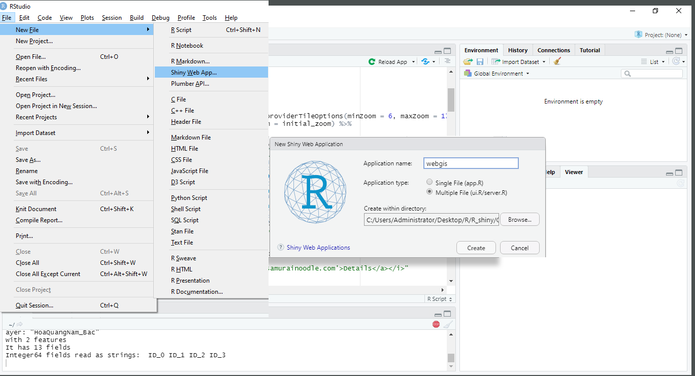
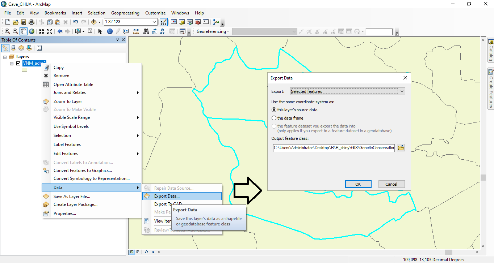

# Lập trình WebGis sử dụng R shiny
### install all pakages before using, please attention on leaflet installation: sudo apt-get install libgdal-dev

## 1. Khởi tạo và yêu cầu
Hệ điều hành: Ubuntu 20.10 hoặc Windows 10 x64
R studio: 1.3.1093
R base: 4.05 trở lên
### 1.1. Tạo mới shiny web
File - New File - Shiny Web App... - Có 2 lựa chọn

  + Single File (app.R)
  + Multiple Files(ui.R và server.R) 
Sự khác nhau của 2 lựa chọn này là: Single File sẽ thực hiện cả 2 chức năng Front End và Back End trong 1 tập tin lập trình. Còn Multiple Files sẽ tách riêng ra thành 2 tập tin khác nhau. Thông thường, file ui.R hay front End sẽ có chức năng hiển thị giao diện và load kết quả từ Back End. Tuy nhiên, khi lập trình đôi khi chúng ta cần thiết kế Front End ngay bên trong file Back End. Ví dụ, khi chúng ta login thành công thì mới hiển thị giao diện điều khiển hay đôi khi chúng ta thiết kế kiểu Dashboard như trong ví dụ này.
### 1.2. Load thư viện
Mở file ui.R và thêm các dòng này lên đầu tập tin:
library(shiny)
library(dplyr)
library(shinydashboard)
library(ggplot2)
library(stringr)
library(DT)
library(shinyBS)
library(shinyjs)
library(shinycssloaders)
library(leaflet)
library(htmltools)
library(sf)
library(leafpop)
library(rjson)
library(rgdal)
Các thư viện này được sử dụng cho dự án WebGIS trong ví dụ. Các bạn có thể đọc hiểu thêm trong các giải thích của R documents. Chú ý, khi cài đặt các thư viện này:
+ Nếu sử dụng R studio hệ điều hành Windows, thì khi load tập tin ui.R có yêu cầu các thư viện thì hệ thống sẽ tự động cài đặt (Không gặp lỗi)
+ Nếu sử dụng R stuio trong hệ điều hành Linux, thì khi load tập tin ui.R có các thư viện như trên, mặc nhiên hệ thống cũng sẽ tự cài đặt. Tuy nhiên, các máy khác nhau thì các thư viện cần thiết cũng khác nhau. Do đó, máy thì đủ và máy thì thiếu nên tốt nhất các bạn sẽ cài đặt thông qua giao diện Terminal:
##### R
##### > install.packages(c("shiny","dplyr","shinydashboard","ggplot2"))
Hoặc lần lượt từng Packages. Khi gặp lỗi ở đâu, hệ thống sẽ báo thiếu thư viện tương ứng và có gợi ý:
##### debian: lib-devxxx /redhat: lib-xxx
# 2. Tạo hiệu ứng bánh xe xoay vòng khi tải trang
###### options(spinner.color="#006272")
# 3. Thiết kế giao diện Dashboard

ui <- dashboardPage(
    ## Tiêu đề của Dashboard
    dashboardHeader(title = "Genetics Conservation"), 
    
    ## Sidebar content
    dashboardSidebar(
        
        )
    ),
    
    ## Body
    dashboardBody(

        )
    )#End DashboardBody
)#End UI Dashboard
## 3.1. Thiết kế dashboardSidebar
dashboardSidebar là khung cửa sổ bên trái, khi click vào biểu tượng Menu thì cửa sổ này sẽ thu gọn lại về bên trái.
### Thiết kế các menuItem
Các menu Item là các dòng Menu để khi click lên dòng nào thì page tương ứng được mở ra. Ví dụ ở đây:
+ menu có tên là Locations nằm trên cùng
+ menu có tên Widgets nằm bên dưới. Bên trong Widgets còn có các menu con:
    menu Infomation
    menu Sequences
    menu Images
Mỗi menu sẽ có các thuộc tính:
+ title: tên hiển thị trên page
+ tabName: để gọi hay kích hoạt trong code
+ icon: được sử dụng từ https://fontawesome.com/v5.15/icons?d=gallery&p=2&q=plug. 
##### Chú ý, khi lựa chọn, có 2 cách: (1) gọi theo tên (icon = icon("pagelines")) (2) gọi theo mã HTML (icon = HTML('<i class="fas fa-dna"></i>')). Tại sao? vì mỗi tên icon có thể có nhiều hình dạng khác nhau nên có khả năng là rhinypage không load được. Cách tốt nhất là dùng mã HTML
ui <- dashboardPage(
    ## Tiêu đề của Dashboard
    dashboardHeader(title = "Genetics Conservation"), 
    
    ## Sidebar content
    dashboardSidebar(
        sidebarMenu(
            menuItem("Locations", tabName = "dashboard", icon = icon("pagelines")),
            menuItem("Widgets", tabName = "widgets", icon = icon("th"),
                     menuSubItem("Infomation", icon = icon("info-circle"),tabName ="infomation"),
                     menuSubItem("Sequences", icon = HTML('<i class="fas fa-dna"></i>'),tabName ="genetics"),
                     menuSubItem("Images", icon = icon("image"),tabName ="image"))
        )#End SideBarMenu
    ),
    
    ## Body
    dashboardBody(

        )
    )#End DashboardBody
    )#End UI Dashboard
## 3.2. Thiết kế dashboardBody
DashboadBody sẽ hiển thị nội dung của WebGIS, trong đó mỗi page được kích hoạt từ menu của sidebarMenu. Để ý có thể nhận thấy, mỗi page được định nghĩa thành một list các tabItems.Trong đó:
##### tabItem có 2 thành phần: (1) tabName = "tên của tabName" trong menuItem; (2) Nội dung hiển thị: Title, Table, Plot, leaflet,... Cụ thể, mỗi đối tượng khác nhau sẽ có cách gọi cũng khác nhau. Ví dụ:
##### + leafletOutput("SHPplot", height = 570)),
##### + h2("Widgets tab content"))
##### + uiOutput("infomation"))
ui <- dashboardPage(
    ## Tiêu đề của Dashboard
    dashboardHeader(title = "Genetics Conservation"), 
    
    ## Sidebar content
    dashboardSidebar(
        sidebarMenu(

        )#End SideBarMenu
    ),
    
    ## Body
    dashboardBody(
        tabItems(
            # MAP tab content
            tabItem(tabName = "dashboard",
                    leafletOutput("SHPplot", height = 570)),
            # Second tab content
            tabItem(tabName = "widgets",
                    h2("Widgets tab content")),
            #Subtab items
            tabItem(tabName = "infomation", 
                    uiOutput("infomation")),
             tabItem(tabName = "genetics", 
                     uiOutput("genetics")),
            
             tabItem(tabName = "image",
                     #tableOutput('files'),
                     uiOutput("image"))
        )#End Tab Items
      )#End DashboardBody
    )#End UI Dashboard
##### Để có thể gọi giao diện của thành phần nào thì trong server.R sẽ ouput thành phần tương ứng.
# 4. Thiết kế nội dung của server.R
## 4.1. Khởi tạo các biến toàn cục:
##### mydata = read.csv("www/mydata.csv",header = TRUE, sep = ";",encoding = 'UTF-8') 
Nội dung của file data như sau:
##### lat;long;high;specifies;Date;Description;Pictures
###### 13.111667;109.225278;36.03;Stephania sp1;24/02/2021; Củ nhỏ như củ khoai, độ dài củ khoảng 29cm, chu vi 12cm, nặng 8g, phần dây leo dài khoảng 60cm;'images/sp1.jpg'
+ Mỗi một cột cách nhau bằng 1 dấu ;
+ lat; long; high: tọa độ GPS
+ species: tên của loài thu mẫu
+ Date: thời gian thu mẫu
+ Description: mô tả về mẫu
+ Picture: mỗi mẫu sẽ có 1 ảnh đại diện

##### sample_loc <- readOGR(dsn ="www/shapefiles/HoaQuangNam_Bac", layer = "HoaQuangNam_Bac")
Tên layer của 2 địa điểm thu mẫu được trình bày trong ArcGIS (xem hướng dẫn làm thế nào để tạo được 2 layer này ở cuối bài viết)

##### icon cho từng địa điểm thu mẫu, sử dụng thư viện của leaflet.
###### greenLeafIcon <- makeIcon(
  ###### iconUrl = "http://leafletjs.com/examples/custom-icons/leaf-green.png",
  ###### iconWidth = 38, iconHeight = 95,
  ###### iconAnchorX = 22, iconAnchorY = 94,
  ###### shadowUrl = "http://leafletjs.com/examples/custom-icons/leaf-shadow.png",
  ###### shadowWidth = 50, shadowHeight = 64,
  ###### shadowAnchorX = 4, shadowAnchorY = 62
###### )

## 4.2. Locations page
shinyServer(function(input, output) {
    
    output$SHPplot <-  renderLeaflet({
        initial_lat = 13.111667
        initial_lng = 109.225278
        initial_zoom = 10
            
        #Add map
        leaflet(data = mydata) %>%
        addProviderTiles ("Esri.WorldImagery", options = providerTileOptions(minZoom = 6, maxZoom = 17)) %>% 
        setView(lat = initial_lat, lng = initial_lng, zoom = initial_zoom) %>%
        
        #Add circle
        #addCircles(lng = 109.204444, lat = 13.071389, weight = 3,radius = 14*100, popup = "Hòa Quang Nam") %>%
        #addCircles(lng = 109.225278, lat = 13.111667, weight = 3,radius = 5*100, popup = "Hòa Quang Bắc") %>%
            
        #Add shape
        addPolygons(data = sample_loc, fill = TRUE, weight = 2, opacity = 0.7, color = "#f55c47", dashArray = "3", smoothFactor = 1, label = ~NAME_3) %>%
            
        #Add marker, popup cac diem thu mau
        addMarkers(~long, 
                   ~lat, 
                   icon = greenLeafIcon,
                   popup = paste("<strong>",mydata$specifies, '</strong>'," ",
                                    "", #Neu trong file data da co dau ' trong duong dan hinh anh & Chu y ca dau cach
                                    #"",  # Neu trong file data khong co dau ' cua duong dan hinh anh & Chu y ca dau cach
                                    " ",
                                    mydata$Description,
                                 " ",
                                 "<i><a href='http://www.samurainoodle.com'>Details</a></i>"
                                 ), 
                   #Cluster options
                   clusterOptions = markerClusterOptions(),
                   clusterId = "samplelocations"
        ) %>%
            
        #Distance and Square
        addMeasure(primaryLengthUnit="kilometers", secondaryLengthUnit="kilometers") %>%
        
        #Add Button
            addEasyButton(
            
                #Zoom in / Out
                easyButton(icon="fa-globe", 
                    title="Zoom to fit map",
                    onClick=JS("function(btn, map){ map.setZoom(6);}"))) %>%
                
                #unfreeze / freeze
                addEasyButtonBar(easyButton(
                    states = list(
                        easyButtonState(stateName="frozen-markers",
                                        icon="ion-toggle-filled",
                                        title="UnFreeze Clusters",
                                        onClick = JS("function(btn, map) {
                                        var clusterManager =
                                        map.layerManager.getLayer('cluster', 'quakesCluster');
                                        clusterManager.unfreeze();
                                                     btn.state('unfrozen-markers');}")),
                
                #freeze
                        easyButtonState(stateName="unfrozen-markers",
                                        icon="ion-toggle",
                                        title="Freeze Clusters",
                                        onClick = JS("function(btn, map) {
                                                var clusterManager =
                                                map.layerManager.getLayer('cluster', 'quakesCluster');
                                                clusterManager.freezeAtZoom();
                                                             btn.state('frozen-markers');}"))        
                    ))) #End of Button
            
    })#End of leaflet
    
    #---------------------------------------------------------------------------
    
    #Lien quan den menu
    output$infomation <- renderUI({
        
      })#End of Infomation
    
    output$genetics <- renderUI({
        
      })#End of genetics Render UI
    
    output$image <- renderUI({
        
      })#End of image Render UI
    })#End of Section Input Output
## 4.3. Information Page
Ta sẽ thấy việc thiết kế giao diện trong backend là cần thiết, vì chỉ khi click lên menu thì page đó mới hiển thị.
Sau mỗi page chỉ việc gọi output$infomation cho ui.R biết.
shinyServer(function(input, output) {
    
    output$SHPplot <-  renderLeaflet({
            
    })#End of leaflet
    
    #Lien quan den menu
    output$infomation <- renderUI({
        fluidPage(
            sidebarPanel(
                img(src='images/sp1.jpg', width = "100%",height ="100%"), #float = "left", margin =  "left", border = "2", pading = "20")
                h4("Scientific classification"),
                "Kingdom: Plantae",
                p(tags$i("Clade"),": Tracheophytes"),
                p(tags$i("Clade"),": Angiosperms"),
                p(tags$i("Clade"),": Eudicots"),
                p("Order: Ranunculales"),
                p("Family: Menispermaceae"),
                p("Genus: Stephania"),
                p("Lour.")
            ),
            mainPanel(
                p(
                    tags$b("Stephania"),
                    "is a genus of flowering plants in the family Menispermaceae, native to eastern and southern Asia and Australia. They are herbaceous perennial vines growing to around four metres tall, with a large, woody caudex. The leaves are arranged spirally on the stem, and are peltate, with the leaf petiole attached near the centre of the leaf. The name Stephania comes from the Greek, a crown. This refers to the anthers being arranged in a crown like manner.",
                    br(),
                    "One species, S. tetrandra, is among the 50 fundamental herbs used in traditional Chinese medicine, where it is called han fang ji. Other plants named fang ji are sometimes substituted for it. Other varieties substituted include Cocculus thunbergii, C. trulobus, Aristolochia fanchi, Stephania tetrandria, and Sinomenium acutun. Notable among these is guang fang ji, Aristolochia fanchi. Because of its toxicity, it is used in TCM only with great caution.",  
                    h4("Selected species"),
                    "There are about 45 species in the genus Stephania, native to the Far East and Australasia.", cite = "[2]", "Species include:",cite ="[3]",
                    
                ),
                fluidRow(
                    column(width=6,
                           #tags$ol(
                           tags$li(tags$i("Stephania aculeata")," FM Bailey"),
                           tags$li(tags$i("Stephania bancroftii")," FM Bailey"),
                           tags$li(tags$i("Stephania brevipes")," Craib"),
                           tags$li(tags$i("Stephania capitata")," (Blume) Spreng."),
                           tags$li(tags$i("Stephania cephalantha")," Hayata"),
                           tags$li(tags$i("Stephamia corymbosa")," (Blume) Walp."),
                           tags$li(tags$i("Stephania crebra")," Forman"),
                           tags$li(tags$i("Stephania elegans")," Hook.f. & Thomson"),
                           tags$li(tags$i("Stephania glabra")," (Roxb.) Miers"),
                           tags$li(tags$i("Stephania glandulifera")," Miers"),
                           tags$li(tags$i("Stephania gracilenta")," Miers"),
                           tags$li(tags$i("Stephania hernandiifolia")," (Willd.) Walp."),
                           tags$li(tags$i("Stephania hispidula")," (Yamamoto) Yamamoto"),
                           tags$li(tags$i("Stephania japonica")," (Thunb.) Miers"),
                           tags$li(tags$i("Stephania kaweesakii")," Jenjitt. & Ruchis")
                           #),
                    ),
                    column(width=6,
                           #tag$ol(
                           tags$li(tags$i("Stephania longa")," Lour. - type species"),
                           tags$li(tags$i("Stephania merrillii")," Diels"),
                           tags$li(tags$i("Stephania oblata")," Craib"),
                           tags$li(tags$i("Stephania papillosa")," Craib"),
                           tags$li(tags$i("Stephania pierrei")," Diels"),
                           tags$li(tags$i("Stephania reticulata")," Forman"),
                           tags$li(tags$i("Stephania rotunda")," Lour."),
                           tags$li(tags$i("Stephania sinica")," Diels"),
                           tags$li(tags$i("Stephania suberosa")," L.L.Forman"),
                           tags$li(tags$i("Stephania subpeltata")," H.S.Lo"),
                           tags$li(tags$i("Stephania tetrandra")," S. Moore"),
                           tags$li(tags$i("Stephania tomentella")," Forman"),
                           tags$li(tags$i("Stephania tuberosa")," Forman"),
                           tags$li(tags$i("Stephania venosa")," (Blume) Spreng.")
                    )
                    #)
                ),#End fluidRow
                fluidRow(
                    h4("Fossil species"),
                    "Stephania palaeosudamericana Herrera et al.",
                    h4("Synonyms"),
                    "Stephania erecta Craib (syn. Stephania pierrei Diels)",
                    h4("Toxicity"),
                    "There is evidence that a few species of Stephania are toxic. However, the most commonly available species in the United States, Stephania tetrandra, has not been shown to be toxic. Any confusion regarding the possible toxicity of Stephania tetrandra was entirely due to an inadvertent shipment of Aristolochia fangchi sent in its stead to a Belgian clinic in 1993. The errant batch of Aristolochia was later confirmed via phytochemical analysis.",
                )
            ),
        )  
            
        
    })#End of Infomation
    
    
    output$genetics <- renderUI({
        
      })#End of genetics Render UI
    
    output$image <- renderUI({
        
      })#End of image Render UI
    })#End of Section Input Output
## 4.4. genetics Page
shinyServer(function(input, output) {
    
    output$SHPplot <-  renderLeaflet({
           
      })#End of leaflet
    
    #Lien quan den menu
    output$infomation <- renderUI({
        
      })#End of Infomation
    
    output$genetics <- renderUI({
        
        #Thiet ke giao dien trong Backend
        fluidPage(width =12,
                    h4("Sequence data"),
                     # hr(),
                     # #Hien thi thanh cuon
                     # div(style = 'overflow-y: scroll; max-height: 500px; overflow-x: scroll; max-width: 100%',uiOutput("dna"))
                  column(width=3,
                         tags$a(href="/dna/BL3-F_E09.ab1", "BL3-F_E09.ab1"),br(),
                         tags$a(href="/dna/BL3-R_F09.ab1", "BL3-R_F09.ab1"),br(),
                         tags$a(href="/dna/BL4-F_G09.ab1", "BL4-F_G09.ab1"),br(),
                         tags$a(href="/dna/BL4-R_H09.ab1", "BL4-R_H09.ab1"),br(),
                         tags$a(href="/dna/BL5-F_G07.ab1", "BL5-F_G07.ab1"),br(),
                         tags$a(href="/dna/BL5-R_H07.ab1", "BL5-R_H07.ab1"),br(),
                         tags$a(href="/dna/E1-F_A10.ab1", "E1-F_A10.ab1"),br(),
                  ),
                  column(width=3,
                         tags$a(href="/dna/E1-R_B10.ab1", "E1-R_B10.ab1"),br(),
                         tags$a(href="/dna/L25-F_F03.ab1", "L25-F_F03.ab1"),br(),
                         tags$a(href="/dna/L25-R_D09.ab1", "L25-R_D09.ab1"),br(),
                         tags$a(href="/dna/L28-F_H03.ab1", "L28-F_H03.ab1"),br(),
                         tags$a(href="/dna/L28-R_B09.ab1", "L28-R_B09.ab1"),br(),
                         tags$a(href="/dna/PY1-F_E10.ab1", "PY1-F_E10.ab1"),br(),
                         tags$a(href="/dna/PY1-R_F10.ab1", "PY1-R_F10.ab1"),br(),
                  ),
                  
                  column(width=3,
                         tags$a(href="/dna/R1-F_C07.ab1", "R1-F_C07.ab1"),br(),
                         tags$a(href="/dna/R1-R_D07.ab1", "R1-R_D07.ab1"),br(),
                         tags$a(href="/dna/R9-F_E07.ab1", "R9-F_E07.ab1"),br(),
                         tags$a(href="/dna/R9-R_F07.ab1", "R9-R_F07.ab1"),br(),
                         tags$a(href="/dna/S2-F_C10.ab1", "S2-F_C10.ab1"),br(),
                         tags$a(href="/dna/S2-R_D10.ab1", "S2-R_D10.ab1"),br(),
                         tags$a(href="/dna/S2a-F_D03.ab1", "S2a-F_D03.ab1"),br(),
                  ),
                  column(width=3,
                         tags$a(href="/dna/S2a-R_H08.ab1", "S2a-R_H08.ab1"),br(),
                         tags$a(href="/dna/S3a-F_E03.ab1", "S3a-F_E03.ab1"),br(),
                         tags$a(href="/dna/S3a-R_F08.ab1", "S3a-R_F08.ab1"),br(),
                         tags$a(href="/dna/TT52-F_A08.ab1", "TT52-F_A08.ab1"),br(),
                         tags$a(href="/dna/TT52-R_B08.ab1", "TT52-R_B08.ab1"),br(),
                         tags$a(href="/dna/TT54-F_C08.ab1", "TT54-F_C08.ab1"),br(),
                         tags$a(href="/dna/TT54-R_D08.ab1", "TT54-R_D08.ab1"),br(),
                  ),
                  
                 )#End fluid page
        
    })
    
    
    #Hien thi hinh anh
    output$image <- renderUI({

      })#End of image Render UI
    })#End of Section Input Output

# 4.5. Images Page
shinyServer(function(input, output) {
    
    output$SHPplot <-  renderLeaflet({
      })
    
    output$infomation <- renderUI({
        
      })#End of Infomation
    
    output$genetics <- renderUI({
       
      })
    
    
    #Hien thi hinh anh
    output$image <- renderUI({
        # #Thiet ke giao dien chon file
        # fileInput(inputId = 'files', 
        #           label = 'Select an Image',
        #           multiple = TRUE,
        #           accept=c('image/png', 'image/jpeg'))
        # 
        # #uiOutput("listimage")
        
        fluidRow(
            column(12, align="center",
                   div(style="display: inline-block;",img(src="images/SP1.jpg", height=300, width=300)),
                   div(style="display: inline-block;",img(src="images/SP2.jpg", height=300, width=300)),
                   div(style="display: inline-block;",img(src="images/SP3.jpg", height=300, width=300)),
                   div(style="display: inline-block;",img(src="images/SP4.jpg", height=300, width=300)))
            )
      })#End of image Render UI
    })#End of Section Input Output
# 5. How to export Shape files from Arcmap
1. Open ArcMap
2. Load Large Map (Vietnam Administration - VNM_adm3.shp)

3. Select feature (Hoa Quang Nam, Hoa Quang Bac):
	Open Attribute table 
		- Select by Hoa Quang Nam, Hoa Quang Bac
		- Zoom to Selected
		- Close Table

4. R_Click Layer - Data - Export Data
	- Tick: this layer's source data
	- Save Output feature data
		Name: HoaQuangNam_Bac.shp
	- OK
	- Add to layer or Not (yes)

5. Add layer to map

