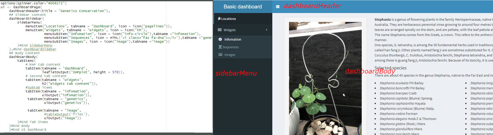

# Lập trình WebGis sử dụng R shiny

## 1. Khởi tạo và yêu cầu
Hệ điều hành: Ubuntu 20.10 hoặc Windows 10 x64
R studio: 1.3.1093
R base: 4.05 trở lên
### 1.1. Tạo mới shiny web
File - New File - Shiny Web App... - Có 2 lựa chọn

  + Single File (app.R)
  + Multiple Files(ui.R và server.R) 
Sự khác nhau của 2 lựa chọn này là: Single File sẽ thực hiện cả 2 chức năng Front End và Back End trong 1 tập tin lập trình. Còn Multiple Files sẽ tách riêng ra thành 2 tập tin khác nhau. Thông thường, file ui.R hay front End sẽ có chức năng hiển thị giao diện và load kết quả từ Back End. Tuy nhiên, khi lập trình đôi khi chúng ta cần thiết kế Front End ngay bên trong file Back End. Ví dụ, khi chúng ta login thành công thì mới hiển thị giao diện điều khiển hay đôi khi chúng ta thiết kế kiểu Dashboard như trong ví dụ này.
### 1.2. Load thư viện
Mở file ui.R và thêm các dòng này lên đầu tập tin:
library(shiny)
library(dplyr)
library(shinydashboard)
library(ggplot2)
library(stringr)
library(DT)
library(shinyBS)
library(shinyjs)
library(shinycssloaders)
library(leaflet)
library(htmltools)
library(sf)
library(leafpop)
library(rjson)
library(rgdal)
Các thư viện này được sử dụng cho dự án WebGIS trong ví dụ. Các bạn có thể đọc hiểu thêm trong các giải thích của R documents. Chú ý, khi cài đặt các thư viện này:
+ Nếu sử dụng R studio hệ điều hành Windows, thì khi load tập tin ui.R có yêu cầu các thư viện thì hệ thống sẽ tự động cài đặt (Không gặp lỗi)
+ Nếu sử dụng R stuio trong hệ điều hành Linux, thì khi load tập tin ui.R có các thư viện như trên, mặc nhiên hệ thống cũng sẽ tự cài đặt. Tuy nhiên, các máy khác nhau thì các thư viện cần thiết cũng khác nhau. Do đó, máy thì đủ và máy thì thiếu nên tốt nhất các bạn sẽ cài đặt thông qua giao diện Terminal:
##### R
##### > install.packages(c("shiny","dplyr","shinydashboard","ggplot2"))
Hoặc lần lượt từng Packages. Khi gặp lỗi ở đâu, hệ thống sẽ báo thiếu thư viện tương ứng và có gợi ý:
##### debian: lib-devxxx /redhat: lib-xxx
# 2. Tạo hiệu ứng bánh xe xoay vòng khi tải trang
###### options(spinner.color="#006272")
# 3. Thiết kế giao diện Dashboard

ui <- dashboardPage(
    ## Tiêu đề của Dashboard
    dashboardHeader(title = "Genetics Conservation"), 
    
    ## Sidebar content
    dashboardSidebar(
        
        )
    ),
    
    ## Body
    dashboardBody(

        )
    )#End DashboardBody
)#End UI Dashboard
## 3.1. Thiết kế dashboardSidebar
dashboardSidebar là khung cửa sổ bên trái, khi click vào biểu tượng Menu thì cửa sổ này sẽ thu gọn lại về bên trái.
### Thiết kế các menuItem
Các menu Item là các dòng Menu để khi click lên dòng nào thì page tương ứng được mở ra. Ví dụ ở đây:
+ menu có tên là Locations nằm trên cùng
+ menu có tên Widgets nằm bên dưới. Bên trong Widgets còn có các menu con:
    menu Infomation
    menu Sequences
    menu Images
Mỗi menu sẽ có các thuộc tính:
+ title: tên hiển thị trên page
+ tabName: để gọi hay kích hoạt trong code
+ icon: được sử dụng từ https://fontawesome.com/v5.15/icons?d=gallery&p=2&q=plug. 
##### Chú ý, khi lựa chọn, có 2 cách: (1) gọi theo tên (icon = icon("pagelines")) (2) gọi theo mã HTML (icon = HTML('<i class="fas fa-dna"></i>')). Tại sao? vì mỗi tên icon có thể có nhiều hình dạng khác nhau nên có khả năng là rhinypage không load được. Cách tốt nhất là dùng mã HTML
ui <- dashboardPage(
    ## Tiêu đề của Dashboard
    dashboardHeader(title = "Genetics Conservation"), 
    
    ## Sidebar content
    dashboardSidebar(
        sidebarMenu(
            menuItem("Locations", tabName = "dashboard", icon = icon("pagelines")),
            menuItem("Widgets", tabName = "widgets", icon = icon("th"),
                     menuSubItem("Infomation", icon = icon("info-circle"),tabName ="infomation"),
                     menuSubItem("Sequences", icon = HTML('<i class="fas fa-dna"></i>'),tabName ="genetics"),
                     menuSubItem("Images", icon = icon("image"),tabName ="image"))
        )#End SideBarMenu
    ),
    
    ## Body
    dashboardBody(

        )
    )#End DashboardBody
    )#End UI Dashboard
## 3.2. Thiết kế dashboardBody
DashboadBody sẽ hiển thị nội dung của WebGIS, trong đó mỗi page được kích hoạt từ menu của sidebarMenu. Để ý có thể nhận thấy, mỗi page được định nghĩa thành một list các tabItems.Trong đó:
##### tabItem có 2 thành phần: (1) tabName = "tên của tabName" trong menuItem; (2) Nội dung hiển thị: Title, Table, Plot, leaflet,... Cụ thể, mỗi đối tượng khác nhau sẽ có cách gọi cũng khác nhau. Ví dụ:
##### + leafletOutput("SHPplot", height = 570)),
##### + h2("Widgets tab content"))
##### + uiOutput("infomation"))
ui <- dashboardPage(
    ## Tiêu đề của Dashboard
    dashboardHeader(title = "Genetics Conservation"), 
    
    ## Sidebar content
    dashboardSidebar(
        sidebarMenu(

        )#End SideBarMenu
    ),
    
    ## Body
    dashboardBody(
        tabItems(
            # MAP tab content
            tabItem(tabName = "dashboard",
                    leafletOutput("SHPplot", height = 570)),
            # Second tab content
            tabItem(tabName = "widgets",
                    h2("Widgets tab content")),
            #Subtab items
            tabItem(tabName = "infomation", 
                    uiOutput("infomation")),
             tabItem(tabName = "genetics", 
                     uiOutput("genetics")),
            
             tabItem(tabName = "image",
                     #tableOutput('files'),
                     uiOutput("image"))
        )#End Tab Items
      )#End DashboardBody
    )#End UI Dashboard
##### Để có thể gọi giao diện của thành phần nào thì trong server.R sẽ ouput thành phần tương ứng.
# 4. Thiết kế nội dung của server.R
## 4.1. Khởi tạo các biến toàn cục:
##### mydata = read.csv("www/mydata.csv",header = TRUE, sep = ";",encoding = 'UTF-8') 
Nội dung của file data như sau:
##### lat;long;high;specifies;Date;Description;Pictures
###### 13.111667;109.225278;36.03;Stephania sp1;24/02/2021; Củ nhỏ như củ khoai, độ dài củ khoảng 29cm, chu vi 12cm, nặng 8g, phần dây leo dài khoảng 60cm;'images/sp1.jpg'
+ Mỗi một cột cách nhau bằng 1 dấu ;
+ lat; long; high: tọa độ GPS
+ species: tên của loài thu mẫu
+ Date: thời gian thu mẫu
+ Description: mô tả về mẫu
+ Picture: mỗi mẫu sẽ có 1 ảnh đại diện

##### sample_loc <- readOGR(dsn ="www/shapefiles/HoaQuangNam_Bac", layer = "HoaQuangNam_Bac")
Tên layer của 2 địa điểm thu mẫu được trình bày trong ArcGIS (xem hướng dẫn làm thế nào để tạo được 2 layer này ở cuối bài viết)

##### icon cho từng địa điểm thu mẫu, sử dụng thư viện của leaflet.
###### greenLeafIcon <- makeIcon(
  ###### iconUrl = "http://leafletjs.com/examples/custom-icons/leaf-green.png",
  iconWidth = 38, iconHeight = 95,
  iconAnchorX = 22, iconAnchorY = 94,
  shadowUrl = "http://leafletjs.com/examples/custom-icons/leaf-shadow.png",
  shadowWidth = 50, shadowHeight = 64,
  shadowAnchorX = 4, shadowAnchorY = 62
)

## 4.2. Locations page
